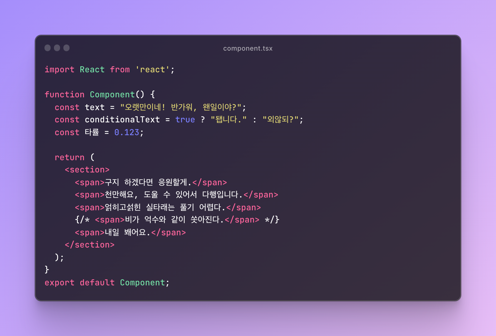
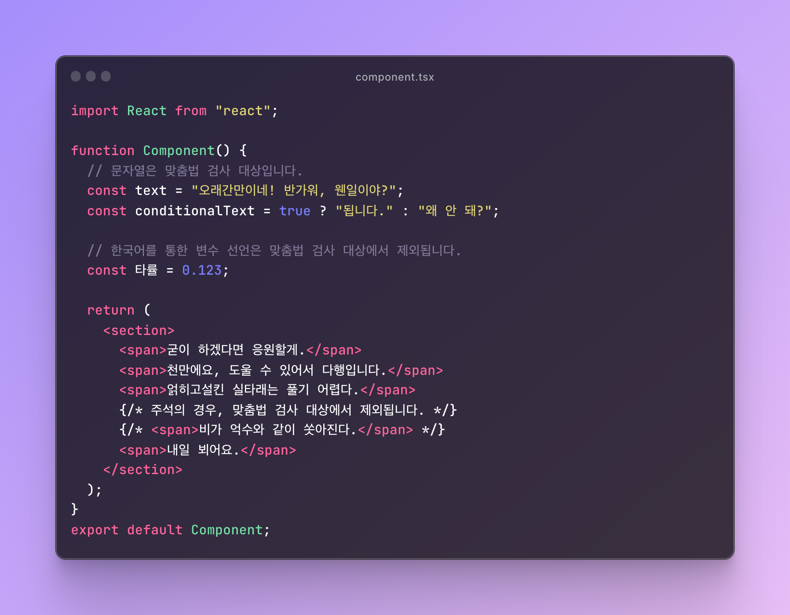

# prettier-plugin-korean-spell-checker

한국어 맞춤법을 검사해주는 prettier 플러그인입니다. [hanspell](https://www.npmjs.com/package/hanspell)을 통해 맞춤법을 검사하며,
반환된 결과를 통해 문자열을 변환합니다.

- before



- after



## Installation

_prettier v3에서만 본 플러그인을 사용하실 수 있습니다._

```shell
npm install -D prettier prettier-plugin-korean-spell-checker @prettier/sync
```

## Configuration

JSON:

```json
{
  ...,
  "plugins": ["prettier-plugin-korean-spell-checker"]
}
```


